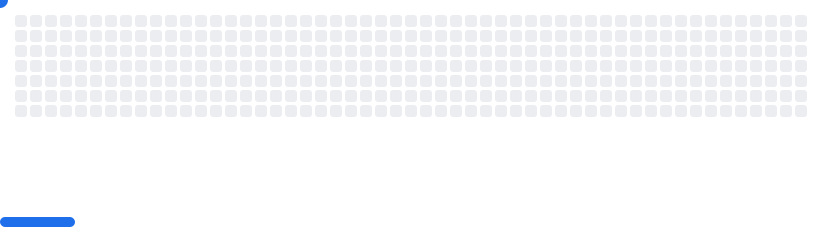

Hi there, I'm Noxety! 👋
About Me
I’m a full-stack developer and freelance graphic designer, debugging life (and code) since 2018. I build scalable web apps, ERP & POS systems, and smooth UI/UX experiences — all powered by React, Laravel, Kotlin, and a dash of caffeine.

🌱 Currently trying to teach AI to do my job so I can focus on coffee breaks ☕

👯 Always open to collaborating on projects that make computers smarter and users happier

📫 Ping me at: thura3.shine33@gmail.com — I promise I don’t bite!

What I’ve Built
AI-powered POS & ERP systems for jewelry businesses (because even diamonds need digital sparkle)

Fitness tracking apps with Kotlin that count calories and steps — mostly for me to justify snacking

Marketing landing pages that look so good, they might just make you buy something you don’t need

Freelancer & client connect desktop apps in C# — connecting humans and machines, one bug at a time


```yaml
name: generate breakout svg

on:
  schedule:
    - cron: "0 */24 * * *"
  workflow_dispatch:

jobs:
  generate-svg:
    permissions:
      contents: write
    runs-on: ubuntu-latest
    timeout-minutes: 5

    steps:
      - name: Checkout repository
        uses: actions/checkout@v4

      - name: generate SVG
        uses: cyprieng/github-breakout@v1.0.0
        with:
          github_username: ${{ github.Noxety}}

      - name: Move generated SVGs
        run: |
          mkdir -p images
          mv output/light.svg images/breakout-light.svg
          mv output/dark.svg images/breakout-dark.svg

      - name: Configure git
        run: |
          git config user.name "github-actions[bot]"
          git config user.email "github-actions[bot]@users.noreply.github.com"

      - name: Commit and push SVGs
        run: |
          git add images/breakout-light.svg images/breakout-dark.svg
          git commit -m "chore: update breakout SVGs" || echo "No changes to commit"
          git push
```

Add them to your README.md:

```html
<picture>
  <source
    media="(prefers-color-scheme: dark)"
    srcset="images/breakout-dark.svg"
  />
  <source
    media="(prefers-color-scheme: light)"
    srcset="images/breakout-light.svg"
  />
  
</picture>
```


## Top Languages


## Connect with Me
- [Personal Website](https://archfolio.dev)

📧 Email me anytime — I read every message, even if it’s just a “Hello, world!”
